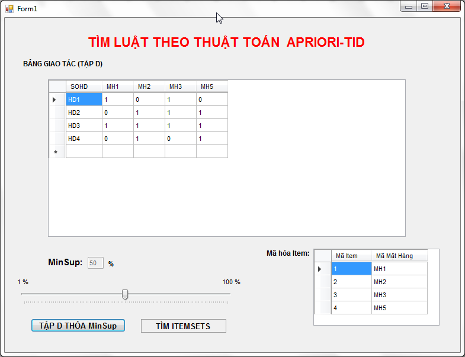
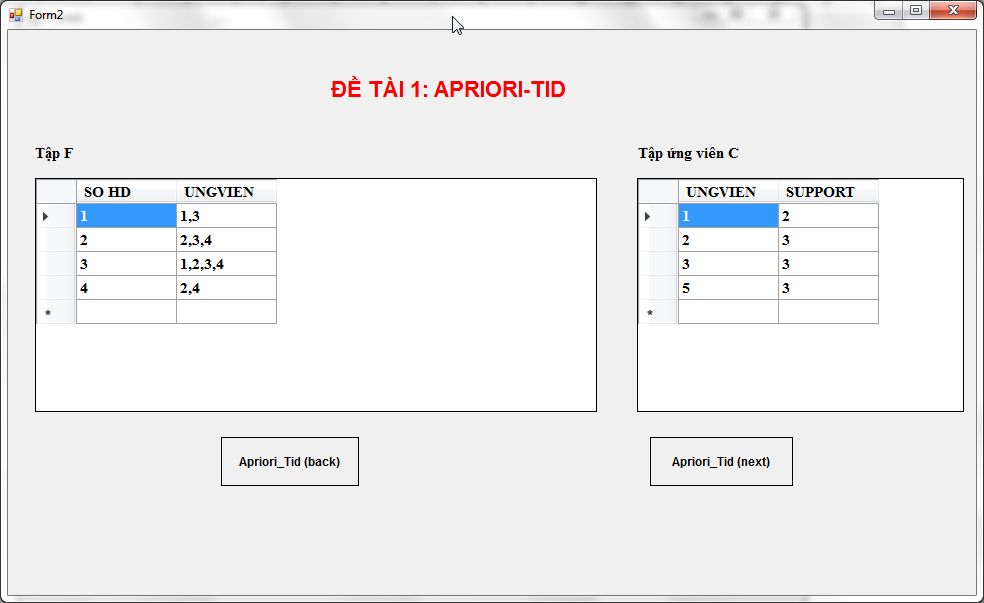
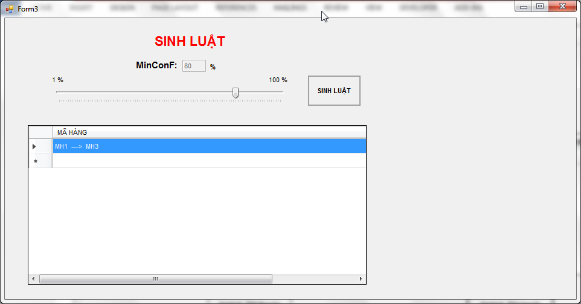

# [INT 14103] KỸ THUẬT LẬP TRÌNH HƯỚNG ĐỐI TƯỢNG

## ĐỀ TÀI: QUẢN LÍ ĐIỂM SINH VIÊN

Cho cơ sở dữ liệu QLDSV chứa điểm thi các môn của các sinh viên. Cơ sở dữ liệu có các tables sau:
MONHOC (MAMH NCHAR(6), TENMH NVARCHAR(100))
DIEMTHI(MASV, MAMH,LANTHI,  DIEM)
Viết chương trình theo thuật toán AprioriTid  tìm ra mối tương quan giữa các mã môn học: Môn học X mà sinh viên thi rớt thì sẽ dẫn đến môn học Y cũng sẽ rớt theo thỏa độ tin cậy tối thiểu. Độ hỗ trợ tối thiểu (minSup) và độ tin cậy tối thiểu (minConf) sẽ được đưa vào khi chạy chương trình
Ghi chú:  Một sinh viên thi một môn học được gọi là rớt khi đã thi qua các lần thi mà điểm vẫn nhỏ hơn 5.

Lưu ý:
-	Chương trình cho phép hiển thị bảng cơ sở dữ liệu giao tác từ cơ sở dữ liệu quan hệ, và support của từng item.
-	Xem tập hợp các itemsets (L2, L3, …, Lk) thường xuyên và support tương ứng 
-	Xem tập luật tìm được với độ tin cậy tương ứng .

## Slide và tài liệu
 > docs folder

## Giao diện thuật toán Apriori-TID

